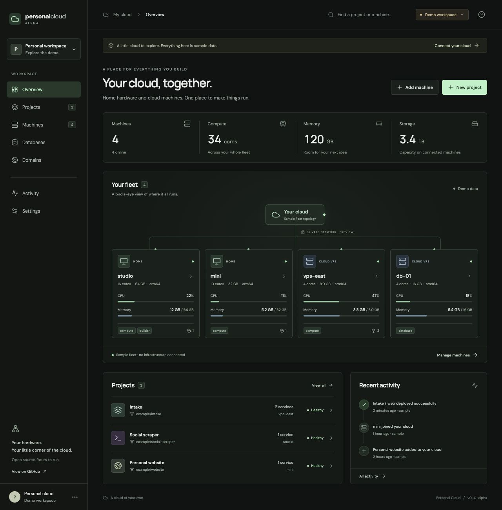

# Personal Cloud

**Your hardware. Your cloud. One place to make things run.**

An open-source personal cloud built around Cloudflare, commodity VPSs, and home hardware. The destination: connect Cloudflare, connect GitHub, add machines, deploy.

> **Early alpha — fleet foundation.** This repository implements the first working milestone, not the full deployment platform. You can organize projects and services, enroll machines, and see real inventory and health updates. GitHub builds, runtime provisioning, WireGuard, public ingress, and managed PostgreSQL are still being built.



## Run locally

Prerequisites: Rust 1.94+, Node 22.12+, pnpm 10, Python 3, Docker Engine/Desktop with Compose. First boot downloads dependencies and the PostgreSQL image.

```sh
git clone https://github.com/nooesc/personal-cloud.git
cd personal-cloud
pnpm install
pnpm dev
```

Open **http://127.0.0.1:4310**. The dashboard starts with a clearly labeled, interactive sample fleet. Select **Connect your cloud** and enter `PC_ADMIN_TOKEN` from the generated `.env` to open your real workspace.

`pnpm dev` generates random local credentials once, starts an isolated PostgreSQL container on loopback port 55438, applies migrations, builds the Rust workspace, and starts the API (4311) and dashboard (4310). Ports are reserved for this checkout. Closing it stops both servers; database records remain in the Compose volume. `docker compose stop` stops the database without deleting data.

Use `127.0.0.1` consistently: browser origin checks intentionally reject `localhost` when the configured origin is `127.0.0.1`. If running the API separately, set `PC_WEB_ORIGIN` to the exact frontend origin.

### Enroll this machine

1. Connect the live workspace, select **Add machine**, choose its location and roles, and create an enrollment token.
2. In Bash, read the copied token without adding it to shell history:

   ```bash
   read -r -s -p 'Enrollment token: ' PC_ENROLL_TOKEN
   export PC_ENROLL_TOKEN
   printf '\n'
   cargo run -p personal-cloud-agent -- --api http://127.0.0.1:4311
   ```

The token expires after 15 minutes and can be claimed once. The agent saves a separate identity in `.pc-agent.json` with mode 0600. On later runs, the saved identity is used; a token is no longer needed. `--state PATH` changes the identity file, and `--once` sends one heartbeat and exits.

The agent reports hostname, OS, architecture, CPU, RAM, root-disk capacity, Docker reachability, and Nomad health every ten seconds. Missing heartbeats become **offline** after 45 seconds; unavailable runtimes become **degraded**. Enrollment does not install runtimes, provision workloads, or change the host network. Remote agents require an HTTPS API URL. GPU inventory, network inventory, automatic install, and the supported Linux VM path for macOS are later work.

## What works today

- Responsive TanStack Start dashboard: fleet map, capacity, projects, machine details, activity, search, and empty/error states.
- Demo mode isolated from live API writes; sample health is explicitly labeled.
- Owner authentication with hashed, expiring, revocable browser sessions and origin checking.
- PostgreSQL-backed projects and service configuration, including desired placement.
- Single-use, expiring enrollment tokens; distinct machine credentials stored only as hashes server-side.
- Rust reporting agent and reconnecting WebSocket fleet snapshots.
- Initial stateless Nomad job compiler with architecture/location constraints and immutable-image validation. **It does not submit jobs or constitute a working deployment controller.**

## Next milestones

1. **Private fleet:** Linux bootstrap, signed releases, Docker/Nomad, WireGuard.
2. **First deploy:** GitHub App and verified webhooks → Railpack → BuildKit → R2-backed OCI registry → health-gated Nomad deployment.
3. **Expose and persist:** Cloudflare Tunnel/DNS/TLS, encrypted application secrets, machine-pinned PostgreSQL.
4. **V1 release:** live logs/metrics, health-gated rollback, failure drills, and the clean-machine ten-minute onboarding test.

Databases never automatically move between machines. The current compiler rejects stateful workloads until volume provisioning exists. Integration pages describe what is planned rather than claiming a connection.

See the [original V1 spec](docs/product/v1-spec.md) and [API contract](docs/api.md). The public roadmap is summarized above; local execution plans stay untracked.

## Development

```sh
pnpm check                   # Rust formatting/tests, web build, TypeScript
cargo clippy --workspace -- -D warnings
pnpm smoke                   # API + Postgres behavior checks; run pnpm dev first
pnpm dev:web                 # UI-only interactive demo, no Postgres required
```

Smoke tests create and clean up only their own test records. They cover authentication, origin checks, persisted project/service writes, duplicate handling, simultaneous enrollment claims, token expiry, isolated credentials, validation, and online/offline/degraded transitions.

```
apps/web/             TanStack Start + React + TypeScript
crates/core/          Shared contracts and initial Nomad placement compiler
crates/control-plane Axum API, SQLx persistence, sessions, WebSockets
crates/agent/         Inventory and heartbeats
migrations/          Versioned PostgreSQL schema
scripts/             Local bootstrap and integration verification
```

### Deployment boundary

This milestone is a local development system, not a production hosting release. It defaults to loopback and uses same-origin Vite proxying. Production frontend serving, TLS termination, credential rotation UI, rate limits, release packaging, backups, and integration provisioning are not implemented. Never expose the development servers directly to the public internet. All six V1 objects have schema space; deployment/database/domain APIs are intentionally unavailable until their controllers exist.

## License

Our code is licensed under [Apache-2.0](LICENSE). Dependencies and external tools retain their own licenses. Nomad is a separately distributed dependency; this project's license does not relicense Nomad.
